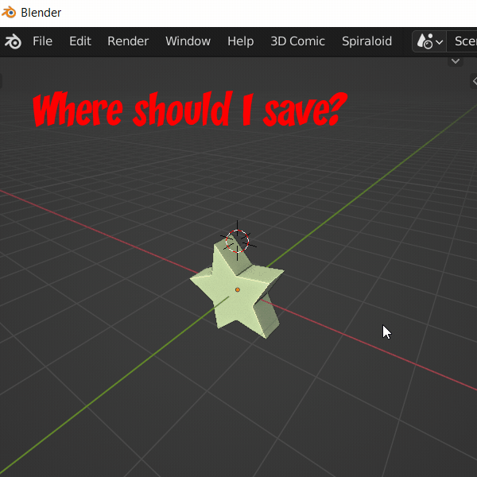

This is my personal setup for blender that merges my muscle memory from using maya, zbrush, mirai and the SFM with most of the blender defaults with some key changes.

here's an [Walkthrough Video](https://youtu.be/I3a72umzCDk)
of how I use it.  Here are some additional youtube walkthrough:

https://youtu.be/l6jw_nYdvIU

I am posting my python scripts here because as I have updated or modified the code to work with blender 3.1 and suit my own workflows. No warranty or support should be implied. I am merely standing on the shoulders of others.   I try to reference the original authors as I can in the history, but for the most part these are all writted from scatch.  Any concerns, feel free to contact me and I can adjust if I agree and have the time. I just want to share as I get with other awesome blender users.

cheers.

-bay

----
Shortcuts
----

Wherever possible I tried to leave it the blender defaults so googling blender shortcuts and tutorials will still kinda work.  x to delete.  A to deselect all or Toggle.  GXYZ RXYZ SXYZ alt-S to move on normal etc all still work.

My adjustments to the UI or hotkeys are made for me, so bear in mind I have a lot of habits from using nearly every 3D tool for the last 25 years in major productions.  I understand that the hotkey memorization I do is abnormal, but this kind of configuration helps me switch tools and makes my work faster.  You likely have your own muscle memory, but this is tuned for mine.

### Keyboard shortcuts:

* ctrl+shift+s Quicksave the current file with a incremental suffix. if file has not been saved yet, a random 3 word name will be generated and the file will be saved in the folder is set in the Spiraloid Addon Preferences.   

* ctrl+shift+o open a windows explorer to the path of the currently open .blend file

### General 3D Navigation:

* alt+LMB orbits the camera  
* alt+RMB dolly’s the camera  
* alt+MMB pan the camera  
* alt+shift+LMB pans the camera.
* alt+v dolly zoom active camera
* alt+shift+wheel turntable the camera.  If you have a weighted throw mouse wheel like an MX master25 this is amazing.  

* alt+a aim at selected.  hit it twice to set the aimpoint to the origin.
* ` toggle between local global pivot placement.  (its called Accent_Grave in the demo video)
* alt+` set view to current camera  (its called Accent_Grave in the demo video)
* alt+1 set view to front
* alt+2 set view to left
* alt+3 set view to top
* alt+shift+1 set view to back
* alt+shift+2 set view to right
* alt+shift+3 set view to bottom

* shift+wheel scrubs though frames
* alt+wheel scrubs though keyframes of selected objects.
* up goes to first frame
* down goes to last frame
* left goes to next keyframe for selected object.
* right goes to previous keyframe for selected object.

* ctrl+wheel expands or shrinks selection in edit mode.
* ctrl+wheel cycles though poses on skinned meshes or armatures (if 3D comic toolkit installed)
* shift+right Arrow isolates the next visible object
* shift+left Arrow isolates the previous visible object

* ctrl Return does a playblast of whatever window is under your mouse.
* ctrl Numpad 0 nukes the selected objects materials and creates a new medium gray material.

* insert cube killer

in the add object menu (shift+a)  there is now a "Cube Killer" menu item.
this will add a random primitve to the scene.  if something is selected, it will DESTROY the selected object and make the new primitive fit the size of the destroyed objects.  this is so that you can bind it to a hotkey (like insert) and hit it over and over again, cycling through random primitives.  if no object is selected, the primitive is created at the cursor.  Death to the default Cube!

### WEIGHT PAINT Mode
* ctrl+shift+LMB will drag a radial gradient of the current weight, tool and strength.
* ctrl+alt+LMB will drag a radial gradient of the current weight, tool and strength.
* x will toggle 0.0 or 1.0 weight

Image Paint mode
* x will toggle black or white color

### OBJECT mode
* w is the tweek tool.  I leave this tool on for everything and use the GRS shortcuts instead of the beginner gizmos.
* ctrl+e move origin to cursor
* f4 apply all transforms.
* alt+d addes a subdivide modifier and two decimation modifiers to the selected objects
* d increase subdiv or LOD level. if already at max level, the decimation modifiers are turned on 
* shift+d decrease subdivs or LOD level.  if at max level, an the decimation modifiers are turned on, they will be turned off instead of decreasing the level.
* m toggle all the modifiers for selected object.  if not object toggle modifiers for all visible objects.
* shift + right/left arrow will cycle through isolating the visible selected object
* ctrl+tab toggle pose mode

### EDIT Mode
* e toggle edit mode.
* double click toggle edit mode
* ctrl+enter exit edit mode (handy for lettering)

* shift+e Extrude edges/vertices/faces
* alt+e selects edge ring
* alt+shift+e selects edge ring
* ctrl+alt+shift+e selects boundary edge loop

* shift+MMB shirnk/fatten selection
* ctrl+shift+MMB crease/uncrease edges

* q now toggles soft modification  (I got tired of reaching for o)
* tab toggles workmode (for render only viewing, too many yeards of muscle memory)
* e toggles editmode  (you can still switch modes w ctrl+tab)
* D and Shift D for up and down subdivs
* alt+D to subdivide selected
* S and F wave for bush size.
* [ and ] for brush size
* ctrl+numpad0 to nuke material/polypaint/texture
* ctrl+shift+LMB to lasso mask
* alt+ctrl+shift+LMB to lasso mask deselect
* ctrl+i invert mask
* ctrl+b blur mask
* ctrl+h hide mask

### SCULPT mode
* ctrl+right sets voxel remesh grid size
* ctrl+r sets remeshes
* ctrl+alt+r uses remeshit from exoside
* right drag horizontal adjusts brush size.
* right drag vertical adjusts brush opacity.
* if you have Quad remesher installed, alt+shift+D will automesh the current model, unwrap and shrink wrap the details onto a multires

### POSE mode
* shift+r will toggle child lock to parent/world.  handy for FK posing.

---

Installation:

WARNING!!!:  Blender users may wish to backup your current configuration before installing in case something goes wrong you can undo.  

For example on a Mac (I don't use Mac so beware)
~/Library/Application Support/Blender/3.1

(or on windows 10)
%APPDATA%\Roaming\Blender Foundation\Blender\3.1

Next

Install blender 3.1 (if you have not already done so)

https://www.blender.org/download/releases/3-1/

Open Blender with admin priviledges and edit  “edit > User Preferences”.

if you have installed the toolkit on an earlier version of blender, just quite blender, open your %appdata% folder and drag the .py addons from the downloaded zip archive into the scripts/addons folder and overwrite all the old addons, restart blender.

if you are installing for the first time:

important: you must install the addons BEFORE the hotkeys.  Some addons like to turn on/off hotkeys, so this means if you install an addon after you've loaded the hotekys, you will need to re-install the hotkeys to get this to work!!!!! 

Under the addon tab, use button at Bottom that says “install add on from file”

Browse to where you downloaded and uzipped the toolit and install every *.py file in the addon folder as you would normaly.

(Remember to activate each them immediately after you install them, otherwise it’s a long list to search through)

I strongly urge you buy your own copy of these paid addons as my hotkeys assume they are installed. xray box select especially since I use it for all seleting.

https://gumroad.com/l/daldj
https://gum.co/dolly_zoom_truck_shift?recommended_by=library
Next

In the preferences Go to the "Keymap", use the button “import key configuration” and browse to this folder and import “spiraloid_hotkeys.py”

Save user preferences.

Next

Open the startup_scene.blend file in this folder.  (don't touch anything at this point unless you know what you're doing and want the state saved as your startup overriding my startup state. 

hit “ctrl U” and say yes to save the startup scene.  This will store the state of all the UI and settings so that every time your launch blender or hit file new, this is what you get. This is your Home state.

If everything went according to plan, everything should be installed.  if everything worked, hit the spacebar and the mirrored subdiv cube in front of you should bounce. 

This is the fast preview playback script I wrote.  Hit spacebar to stop playing time and note that the current frame has returned whatever frame you were editing before you hit spacebar.

CONGRATS!  Everything is installed. 

---

Addon notes:

(unless the addon states I wrote it, these are grabbed from elsewhere online and copyrtight, support etc stays with the original author.  I'm just collecting them in this repo to have them in once place.  See source code documentation of each addon for more info)

---

MirrorAllVertexGroups.py

this script adds a "Mirror all Vertex Groups" item to the vertex groups menu that will copy all vertex groups from one side of a model to the other for a symmetrical mesh.  this means you can paint weights for the left hand, legs, torso etc and then mirror all weights to the other side (the other side weights are overwritten).  There is a small options menu that comes up to let you choose an axis, copy direction etc.

---

FastPreview.py

This adds a "preview" button to the timeline.  when pressed this will playback (or preview) the current range from the beginning and when pressed again, will return the current frame to the frame before preview.  This is most usefull when refining a pose and wanting to see how it feels in motion without having to constantly place the edit frame over and over again.  When animating, I recommend binding it to the spacebar using view3d.fast_preview (and moving the search to another key, like command+s)
Note: when zoomed into a range in the graph editor, the fast preview will use that range.  view all to play from beginning.

---

AimAtSelected.py

This adds an "Aim Selected" item to the view menu.  This will move the cursor to the selected element and aim the camera at it.  I recomend binding it to alt+a or cmd+a

---

SmoothAnimationLoop.py

This adds a menu to the graph editor > key > smmooth animation loop.  enter the number of frame the falloff should effect and the animation curves at the end of your selected animation will be moved to the values at the start of the animation with a falloff.

resize_images.py
obvious

SubdNavigator.py
adds a subdivide modifier to add visile and lets you go up and down resolutions w D and Shift+D

ToggleWeights.py
allows you to use X to switch between 0.0 and 1.0 weighting.  useful for ctrl+shift+drag and ctrl+alt+drag for linear/radial gradient weighting.

Toggle_hide.py
allow H store recall hide toggle to work.

brush_quickset.py
lets the "[" and "]" do brush sizing like photoshop.

---

I also strongly suggest these paid addons:

xray select
https://gumroad.com/l/daldj

dolly zoom
https://gum.co/dolly_zoom_truck_shift?recommended_by=library

Voxel heat diffuse skinning
https://blendermarket.com/products/voxel-heat-diffuse-skinning

https://gumroad.com/l/mfGbS

https://gumroad.com/l/uvpackmaster

https://blendermarket.com/products/auto-rig-pro

http://renderhjs.net/textools/blender/

https://lollypopman.com/2016/08/09/addon-shapekey-helpers/

https://en.blender.org/index.php/Extensions:2.6/Py/Scripts/Animation/Corrective_Shape_Key

https://www.blendernation.com/2016/06/15/addon-zaloopok/

https://gitlab.com/AquaticNightmare/space_switcher/-/wikis/home

---

good luck with your art.

-b

my 3D Comics can be found at:
http://3dcomic.shop

